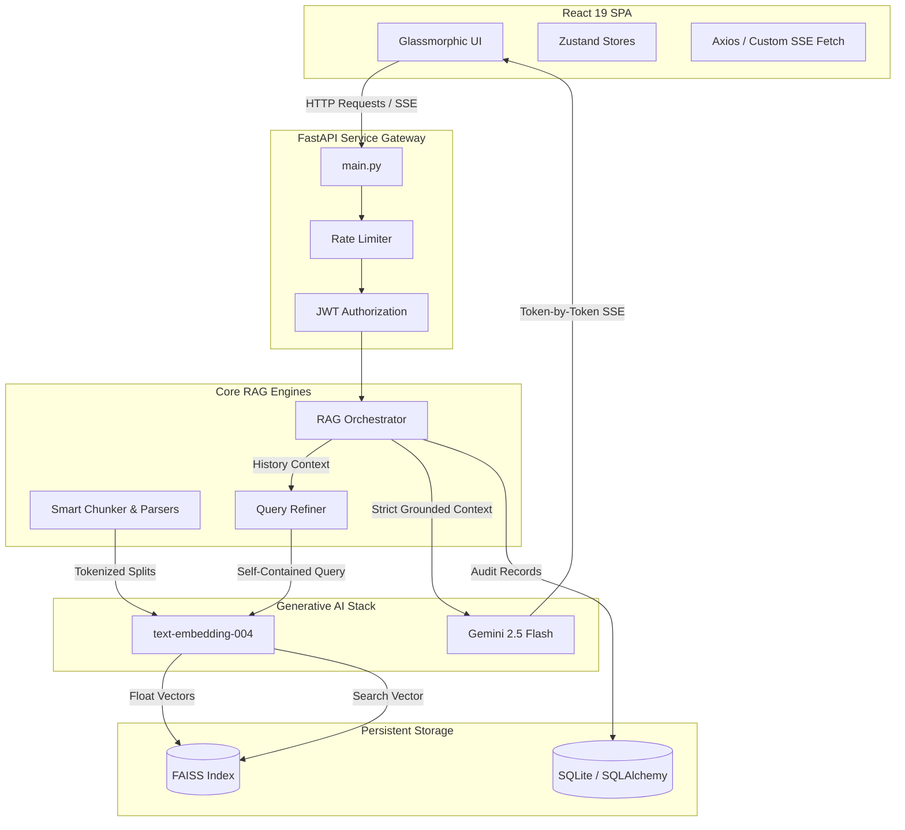

# Enterprise-Grade RAG Chat Assistant

A complete, production-quality Retrieval-Augmented Generation (RAG) Chat Assistant powered by a modern FastAPI backend and a React 19 single-page SaaS interface. The system leverages real-time semantic embeddings, a CPU-optimized FAISS vector search index, historical query rewriting, and strict context grounding to prevent hallucinations.

---

## 1. System Architecture



---

## 2. Key Features

- **Real-Time Word-by-Word Streaming**: Uses Starlette `StreamingResponse` Server-Sent Events (SSE) matched with a custom browser `fetch` buffer reader to yield instant word-by-word streaming responses under JWT security.
- **Strict Hallucination Prevention**: Automatically drops retrieved chunks below a cosine similarity of `0.75`. If no source matches, the LLM prompt is bypassed entirely, and a strict grounded fallback message is output.
- **Smart Recursive Chunker**: Parses PDF, DOCX, TXT, and JSON files and tokenizes them into exact 400-token chunks with 50-token overlaps using `tiktoken` encodings (`cl100k_base`).
- **History-Aware Query Refiner**: Prioritizes dialogue coherence by automatically rewriting conversational pronouns into standalone searches (e.g. *"How do I reset it?"* -> *"How do I reset my password?"*) using Gemini 2.5 Flash before hitting the vector database.
- **Detailed References Citations Drawer**: Clicking a bracketed citation footnote opens a slide-over cards pane reporting the exact document name, chunk index, vector similarity match percentage, and the verbatim source paragraph retrieved.
- **Star Feedback Loop**: Users can submit 1 to 5 star ratings and optional notes for any assistant answer, recorded in the database.
- **Administrative Operations Panel**: Accessible to users with the `admin` role, providing real-time system performance statistics, total token audits, and searchable operational logs.

---

## 3. Mathematical Vector Search Logic

We use **Cosine Similarity** to compare query embeddings with our document chunks.
The Cosine Similarity between a query vector $q$ and a document chunk vector $d$ is defined as:

$$\text{Cosine Similarity}(q, d) = \frac{q \cdot d}{\|q\| \|d\|}$$

In our thread-safe `VectorStoreManager`, we optimize this operation using **FAISS** (`faiss.IndexFlatIP` - Inner Product index). 

1. **L2 Normalization**: Upon document ingestion and search execution, we normalize every vector to have a unit length ($\|x\| = 1$).
2. **Inner Product Equivalence**: For normalized unit vectors, the inner product is mathematically identical to cosine similarity:

$$\text{Inner Product}(q, d) = q \cdot d = \frac{q \cdot d}{1 \cdot 1} = \text{Cosine Similarity}(q, d)$$

This allows FAISS to run CPU-optimized vector calculations at scale while guaranteeing that every result maps exactly to a cosine similarity metric.

---

## 4. Environment Configuration

Copy `.env.example` in the root directory to `.env` and fill in your variables:

```bash
cp .env.example .env
```

| Variable | Description | Default |
| :--- | :--- | :--- |
| `GEMINI_API_KEY` | Google GenAI API Key (from AI Studio) | *Required* |
| `DATABASE_URL` | SQLAlchemy SQLite Async Database URL | `sqlite+aiosqlite:///./rag_assistant.db` |
| `JWT_SECRET_KEY` | Secret signing key for JWT tokens | *Change in Production* |
| `CHUNK_SIZE` | Target token size per chunk | `400` |
| `CHUNK_OVERLAP` | Overlap token size between chunks | `50` |
| `SIMILARITY_THRESHOLD` | Cosine Similarity cutoff rating | `0.75` |
| `TOP_K` | Maximum chunks to fetch per query | `5` |

---

## 5. Development Quickstart (Manual Run)

### Backend Setup
1. **Navigate and create a virtual environment**:
   ```bash
   cd backend
   python -m venv venv
   source venv/Scripts/activate  # On Windows: venv\Scripts\activate
   ```
2. **Install dependency libraries**:
   ```bash
   pip install -r requirements.txt
   ```
3. **Start the ASGI dev server**:
   ```bash
   python main.py
   ```
   *The backend will boot on `http://localhost:8000`. Direct your browser to `http://localhost:8000/docs` to inspect interactive Swagger API specifications.*

### Frontend Setup
1. **Navigate and install NPM packages**:
   ```bash
   cd ../frontend
   npm install
   ```
2. **Launch the Vite development hot reload server**:
   ```bash
   npm run dev
   ```
   *The client dashboard will compile and launch on `http://localhost:5173`.*

---

## 6. Docker Deployment (Simplified Run)

The entire system is containerized and ready for instant deployment using Docker and Compose.

1. **Verify your `.env` contains your generative keys**:
   ```ini
   GEMINI_API_KEY=AIzaSy...
   ```
2. **Run docker-compose**:
   ```bash
   docker-compose up --build -d
   ```
3. **Operational Ports**:
   - **Frontend Hub**: `http://localhost` (Port 80)
   - **FastAPI Core**: `http://localhost:8000` (Port 8000)

---

## 7. Security Architecture

1. **Password Encryption**: Employs industry-standard `bcrypt` via FastAPI `passlib` context to hash credentials.
2. **SQL Injection Guard**: Completely avoids dynamic query concatenations, routing all SQLite communications via SQLAlchemy parameter bindings.
3. **Token Bucket Rate Limiting**: Features a thread-safe ASGI middleware checking request frequency per client IP (default chat limit: 60 queries/min).
4. **Directory Traversal Protection**: Renames and hashes uploaded document paths, preventing malicious path manipulations or execution.
5. **Cross-Site Scripting (XSS) Prevention**: Dynamically escapes and sanitizes Markdown rendering layouts on the client.

---

## 8. Role-Based Access Control & Bootstrapping

We support standard Role-Based Access Control (`admin` and `user` privileges).

- **Bootstrap Administrator**: To simplify initial setups, **the very first user registered in the database is automatically assigned the `admin` role**. Subsequent sign-ups are given standard `user` status.
- Simply register your first local developer account to immediately unlock the system control panel and analytics dashboard!
